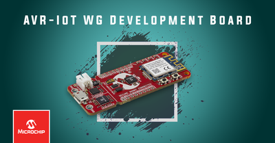
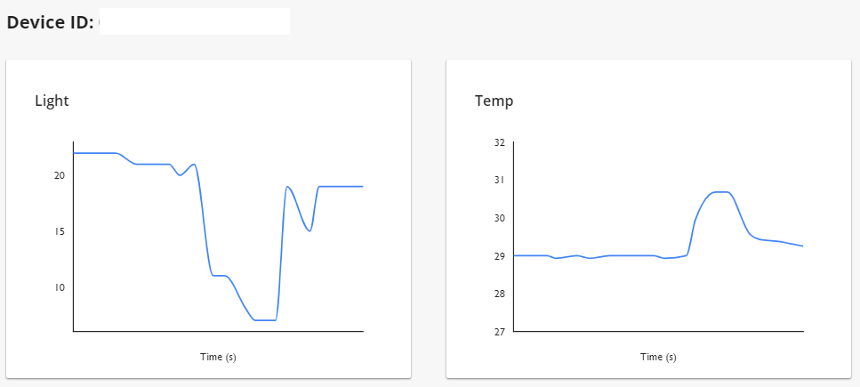
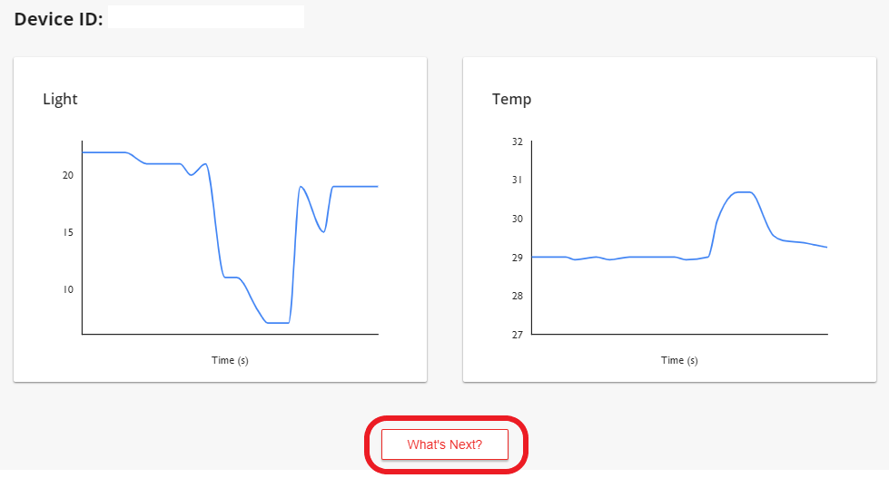
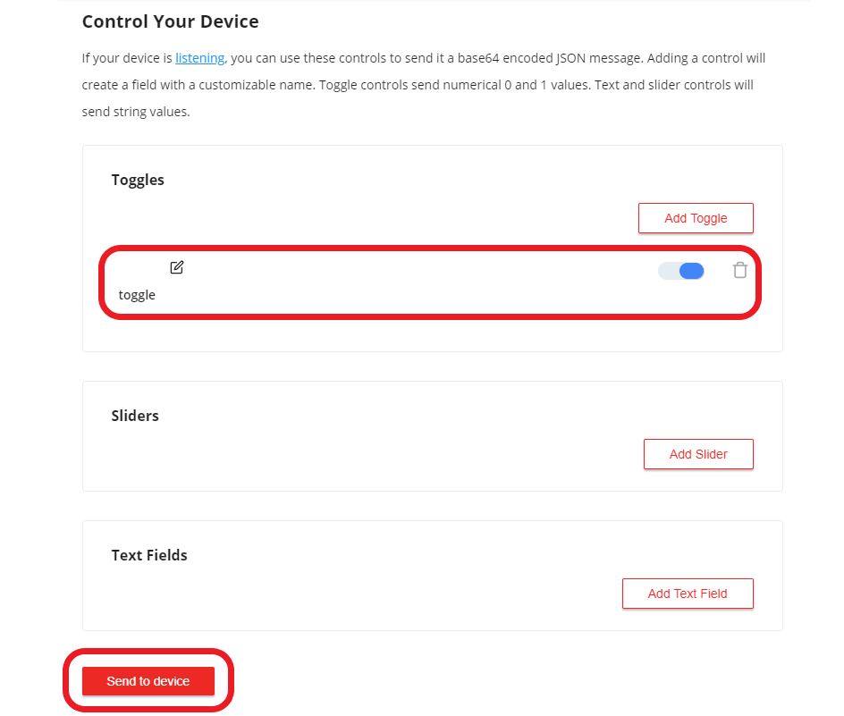
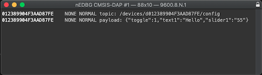
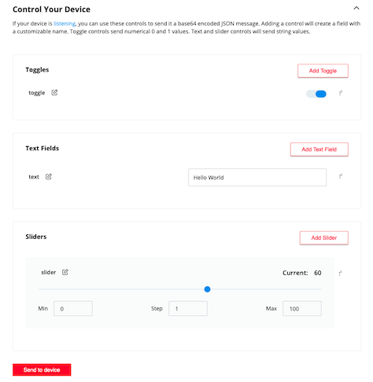

# Getting Started Guide: Microchip AVR-IoT WG (Wireless for Google Cloud) Application

Devices: \| **ATmega4808(MCU)** \| **WINC1510(Wi-Fi®)** \| **ECC608(CryptoAuthLib)** \|

---

---
## Getting Started Guide
   + Below describes the Out of Box (OOB) operation of the development board. 
   + More detailed information can be found further below this document.
   + For accessing production hex files, release notes, and Known Issues please click the [release tab](https://github.com/microchip-pic-avr-solutions/avr-iot-google-sensor-node-mplab/releases)

### Materials
   + Internet Connection Device
   + Wifi / Network Device
   + Personal Computer
   + Serial Terminal (optional)

### Operation
  1. Connect board to PC using USB-micro cable. 
     + The LEDs will **Cycle** upon startup: **BLUE-->GREEN-->YELLOW-->RED**.
     + Short delay: **BLUE-->GREEN-->YELLOW-->RED**.

  2. The **BLUE LED** will begin to blink, this indicates the board is attempting to join the local **ACCESS POINT**.

  3. On connecting to **Access Point** the blinking will stop, and the **LED** will become **STATIC**.
     + By **Default**, the device will attempt to use:
      + **WPA/WPA2**  
      + Network Name: **MCHP.IOT**    
      + Password: **microchip**

  4. To use custom Credentials, the board will appear on the PC enumerated as a mass storage device under the name **CURIOSITY**. 
     + Credentials can be downloaded as the file **WIFI.CFG** using the **CLICK-ME.HTM** file stored on the **CURIOSITY** device.
     
     

  5. After becoming connected to the **ACCESS POINT**, the **GREEN LED** will begin to blink, this indicates the board is attempting to establish a web connection with cloud providing service. 
     + **GREEN LED** will stop blinking and remain **ON** when connection is established.
     + Using the in-module TCP/IP stack pre-configured with provisioned credentials; the device establishes a **MQTT** connection with the IoT Broker provider (Google).

      

  6. After successfully establishing MQTT connection, the **YELLOW LED** will blink. (250 mSec)
     + Indicating data exchanged between the End-Device (AVR-IoT), and BROKER (Google). (every (1) Sec)

  7. Connect to the www.avr-iot.com/gcp/**{deviceID}**, or www.pic-iot.com/gcp/**{deviceID}**, device specific website to view publish/subscribe data. 
     + **{deviceID}** is the unique identifier for the development board.
     + This page can be also be found via launching the **CLICK-ME.HTM** file on the **CURIOSITY** device.
     + This page can be also be found by scanning the QR code on the back of the development board. 

     

  8. There will be (2) scrolling graphs visible.
      + (1) shows temperature sensor
      + (1) shows the light sensor value. 

     

  9. Click on the **What's Next** button beneath the graphs to peform action(s) from the cloud.
  
     

  10. Select the **Implement a Cloud-Controlled Actuator** to demostrate cloud performed behaviors.

      

  11. Click on the **Learn More** button to expand page interface. 
      + Scroll to the bottom of **Step 5** where a panel will read **Control Your Device**.

      

  12. By default only a **Toggle** feature is supported by the firmware.
      + **Custom implmentations are described further on above the panel.**

      

  13. Trigger an action by simply pressing the **Send to device** button beneath actuator fields. 
     + All Actuator data is sent as one message when the **Send to device** button is pressed.
     + When **Toggled** the **YELLOW LED** will remain on for **(2) Seconds**.
     + When unselected, the **YELLOW LED** will remain off for **(2) Seconds**.
     + Because **Toggle** manipulates the **desired** state; the state **must** be changed to observe the behavior. 

   14. If desired, additional basic messaging can be seen to a connected Serial Terminal at the expected 9600 baud rate. 
       
	   

## Requirements

+ **MPLAB® X Integrated Development Environment (IDE) v5.25 or later**:
MPLAB® X IDE is a computer software program based on the open source NetBeans IDE from Oracle. It is used to develop applications for Microchip microcontrollers and digital signal controllers. It runs on Windows®, Mac OS® and Linux®. 
For the latest version, please refer to: [MPLAB-X](https://www.microchip.com/mplab/mplab-x-ide)

+ **MPLAB® XC8 Compiler v2.05 or later**:
MPLAB® XC compilers support all of Microchip’s PIC, AVR and dsPIC devices where the code is written in the C programming language. XC8 is the recommended compiler for 8-bit PIC MCUs and is also supported by some AVR devices. In this lab, as well as with the succeeding labs, you will be using MPLAB® XC8 for an AVR MCU.
For the latest version, please refer to: [XC-Compiler](https://www.microchip.com/mplab/compilers)

+ **Compiler Optimization**
Compilation of source code can be achieved using supporting MPLAB® XC compiler: **XC8** or **AVR 8-bit GNU Toolchain**.
 * XC8 Compiler v2.05 or later: Supported by optimization **level 1, 2 (free)** and **level s (pro)**
 * AVR GNU Toolchain v3.62: Supported by optimization **level 1, 2 (free)** and **level s (pro)**.

MPLAB® X IDE XC8 support all 8-bit PIC® and AVR® microcontrollers (MCUs). This is a internally developed compiler which is specially designed to maximize features aviable to the PIC® and AVR® microcontrollers (MCUs).

The Atmel AVR 8-bit GNU Toolchain (3.6.1.1750) supports all AVR 8-bit devices. The AVR 8-bit Toolchain is based on the free and open-source GCC compiler. The toolchain includes compiler, assembler, linker and binutils (GCC and Binutils), Standard C library (AVR-libc) and GNU Debugger (GDB).

+ **AVR IoT Development Board**:
The AVR-IoT WG development board combines a powerful 8-bit ATmega4808 MCU, an ATECC608A CryptoAuthentication™ secure element IC and the fully certified ATWINC1510 Wi-Fi® network controller - which provides the most simple and effective way to connect your embedded application to a cloud platform. The board also includes an on-board debugger and requires no external hardware to program and debug the MCU.

---

## Application Scope
The AVR-IoT development board has been created with the intention of demostrating a one source solution for evaluation of existing cloud provider solutions. 
This example end-device leverages the catalog of devices, and libraries provided through Microchip's extensive product line to showcase a basic Internet of Things product connection. Data exchange between server and in field device is implemented using on board sensors for temperature, and light value observations. Behavior actions are demonstrated through visual indication of the 'Data' LED as controlled through the Web based APIs. 

General Out-Of-Box operation is as described below:
1) Use the On-Board WINC1510 WiFi module to establish local WiFi connection to Router/Switch or Network source. 
2) The WINC1510 through use of the ECC608 Cyrpo establishes a Secure (TLS) Socket Connection with select Cloud Provider using a TCP connection. The Blue 'WiFi' LED is used to indicate this status. 
3) Using the Microchip Software Library for the Message-Queuing-Telemetry-Transport (MQTT) standard format; data is exchanged between client (end-device) and broker (cloud). The Green 'Connect' LED is used to indicate this status. 
4) Sensor Data is sent as Telemetry Data between device and broker at a near periodic rate of (1) Second. The Yellow 'Data' LED is used to indicate this status. 
5) Capture of Data sent from Broker to Device can be observed through a Serial terminal when USB-Micro is connected to development board. 
6) Behavior variation can be observed on the 'Data' LED when triggered through the web based API, and sent through the broker to end device using MQTT protocol transported through the TCP connection securely established using the ECC608 Crypto device. 
7) The Push button has no effect outside of variation of start-up operation; refer to User Guide for additional information regarding Soft-AP operation.

* The Red 'Data' LED remaining on may indicate a hardware fault issue with the development board.

---

## Application Description

### Cloud Platforms

+ Google
  1. Publish payload for sensor data
     * topic:   
     ``/devices/deviceID/events ``
     * payload:  
     ``{"Light":lightValue,"Temp":temperatureValue} ``
  2. Subscribe packet from device
     * topic:   
     ``/devices/deviceID/config ``
 
#### The AVR IoT WG development board publishes data from the on-board light and temperature sensor every second to the cloud.
#### The data received over the subscribed topic is displayed on a serial terminal.

### Sending MQTT publish packets  
+ The C code for sending MQTT publish packets is available in AVRIoT.X/mcc_generated_files/application_manager.c file.
+ The API ``static void sendToCloud(void)`` is responsible for publishing data at an interval of 1 second.

### Sending MQTT subscribe packets
+ The C code for sending MQTT subscribe packets is available in AVRIoT.X/mcc_generated_files/application_manager.c file.
+ The API ``static void subscribeToCloud(void)`` is responsible for sending MQTT subscribe packets to the cloud after MQTT connection is established.

### Processing Packets received over subscribed topic 
+ The C code for processing MQTT publish packets received over the subscribed topic is available in AVRIoT.X/mcc_generated_files/application_manager.c file.
+ The ``static void receivedFromCloud(uint8_t *topic, uint8_t *payload)`` function is used for processing packets published over the subscribed topic.

---

## Secure Provisioning & Transport Layer Security

1. The AVR-IoT board under the Wireless for Google Cloud (WG) variation is shipped pre-provisioned for coordination with the Google Cloud system.
2. Security is achieved by using the built-in Transport Layer Security (TLS) 'stack' configured within the WINC Wi-Fi Module.
3. This process has been performed to allow for an Out Of Box (OOB) operation of the AVR-IoT development board along with supporting web page.

---

## Detailed Operation

  0. There are three possible variations within application behavior possible by holding push buttons on startup
     + Default behavior: No Button Pressed
     + Soft AP: SW0 is Held on startup (see description farther in document)
     + Default behavior Restore DEFAULT Credentials: SW0 & SW1 Held on startup. This state is reflected by **BLINKING GREEN LED** until a Wi-Fi connection is established. 
          + After a successful connection; last VALID CREDIENTIALS are maintained in the WINC for next power cycle connection. 

  1. Connect board to PC using USB-micro cable. 
     + The LEDs will **Cycle** upon startup: **BLUE-->GREEN-->YELLOW-->RED**, short delay, **BLUE-->GREEN-->YELLOW-->RED**.

  2. The **BLUE LED** will begin to blink, this indicates the board is attempting to join the local **ACCESS POINT**. 

  3. Update the Wi-Fi Credentials; upon connecting the blinking will stop, and the **LED** will become **STATIC**. Below are the easiest methods to update credentials.
     + The board will appear on the PC enumerated as a mass storage device under the name **CURIOSITY**. 
     + Credentials can be downloaded as the file **WIFI.CFG** using the **CLICK-ME.HTM** file stored on the **CURIOSITY** device. 
     + This will launch the URL: https://avr-iot.com/device/{DeviceId} The file produced with entered credentials is produced through the WINC module, and no information is shared through the internet. 
     + Drag and Drop, or Copy and Paste the **WIFI.CFG** file onto the **CURIOSITY** device to load new credentials onto the IoT demonstration board. 
     + Use a **Serial Terminal** to update the Wi-Fi Credentials loaded onto the WINC module. 
     + Use the Command Line Interface (CLI) supported command ``wifi host_name,pass_code,auth_type`` | host_name/pass_code are entered strings, auth_type is int value: (0: open, 1: WEP, 2: WPA).

  4. After becoming connected to the **ACCESS POINT**, the **GREEN LED** will begin to blink, this indicates the board is attempting to establish a TCP/IP connection with the cloud providing service. 
     + The **GREEN LED** will stop blinking and become **STATIC** when the **Transport Layer Security (TLS)** connection is established.

  

  5. Once the TCP/IP connection is made, the device will attempt a **MQTT** connection with the IoT Broker provider. 
     + After becoming connected, the **YELLOW LED** will blink, indicating data exchanged between the End-Device (AVR-IoT), and BROKER (AWS).
     + When using the **Toggle** feature described **below**; the **YELLOW LED** will remain ON/OFF for **(2) Sec** intevals before resuming normal operation.

  6. Connect to the www.avr-iot.com/google/**{DeviceID}**, or www.pic-iot.com/google/**{DeviceID}**, device specific website to view publish/subscribe data. 
     + This page can be found via launching the **CLICK-ME.HTM** file on the **CURIOSITY** device.
     + There will be (2) scrolling graphs visible. (1) shows temperature sensor, (1) shows the light sensor value.
     + There will be (3) rows beneath the **Control Your Device** section used to publish subscription data to end-devices through the broker. 
     + These example rows demonstrate options for: Toggle (boolean), Text Field (String), Sliders (integer)

  7. When connection is established with the Broker, the publish message topic will be printed to a serial terminal through the CDC-USB bridge at a 9600 Baud Rate.
     + When a topic subscription is received, the payload is printed in JSON format to the terminal. 
     + Topic subscription message are sent when the 'Send to device' push button on the webpage is pressed. This will send the data of the toggle switch, text field, and slider options. 

## Additional Operations

### Command Line Interface
+ The AVR-IoT WG development board can also be accessed through a serial command line interface. 
+ This interface can be used to provide diagnostic information. 
+ To access this interface, use any preferred serial terminal application (i.e. Teraterm, Coolterm, PuTTy) and open the serial port labeled Curiosity Virtual COM port, with the following settings:

| - | - |
| :---: | :---: |
| Baud Rate | 9600 |
| Data | 8-bit |
| Parity Bit | None |
| Stop Bit | 1 bit |
| Flow Control | None |
| Additional Settings | Local Echo: On |
| Transmit to the Microcontroller | CR+LF (Carriage Return + Line Feed) |

**Note:**  For users of the Windows environment, the USB serial interface requires the installation of an USB serial port driver.

| Command | Arguments | Description |
| :---: | :---: | :---: |
| reset | - | Reset the settings on the device |
| device | - | Print the unique device ID of the board |
| key | - | Print the public key of the board |
| reconnect | - | Re-establish connection to the Cloud |
| version | - | Print the firmware version of the serial port user interface |
| cli_version | - | Print the command line interface firmware version of the serial port user interface |
| wifi | Network SSID, Password, Security Option | Enter Wi-Fi® network authentication details |
| debug |  Debug Options | Print debug messages to see status of board operation |

**wifi Security Options:**
+ 0 : Open - Password and Security option parameters are not required. 
+ 1 : WPA/WPA2 - Security Option Parameter not required.
+ 2: WEP - 

**debug Debug Options:**
Type in a number from 0 to 4; for the number of debug messages with 0 - the result is printing no messages and with 4 for printing all the messages.
+ 0 : Minimal
+ 1 : Critical
+ 2 : Warning
+ 3 : Info
+ 4 : All

### Soft Access Point (AP)
The AVR-IoT WG development board can be accessed through a Wi-Fi access point enabled by the Software-Enabled Access mode of the WINC1510. This can be another way to connect the board to a Wi-Fi network. To enter Soft AP mode, press and hold the SW0 push button before plugging in the board. When connecting to the module hosted access point, the user will need to enter the desired SSID and password credentials for the network. After the user enters the details, pressing the Connect button will reconfigure network credentials for the device.

---

## Software Features

### WINC
Microchip's WINC1510 is a low-power consumption 802.11 b/g/n IoT (Internet of Things) module,
specifically optimized for low-power IoT applications. The module integrates the following: Power
Amplifier (PA), Low-Noise Amplifier (LNA), switch, power management, and a printed antenna or a micro
co-ax (u.FL) connector for an external antenna, resulting in a small form factor (21.7 x 14.7 x 2.1 mm)
design. It is interoperable with various vendors’ 802.11 b/g/n access points. This module provides SPI
ports to interface with a host controller. The WINC1510 provides internal Flash memory as well as
multiple peripheral interfaces, including UART and SPI. The only external clock source needed for the
WINC1510 is the built-in, high-speed crystal or oscillator (26 MHz). The WINC1510 is available in a QFN
package or as a certified module.

### Crypto Authentication Library (CAL)
The ATECC608A is a secure element from the Microchip CryptoAuthentication™ portfolio with advanced
Elliptic Curve Cryptography (ECC) capabilities. With ECDH and ECDSA being built right in, this device is
ideal for the rapidly growing IoT market, by easily supplying the full range of security such as
confidentiality, data integrity, and authentication to systems with MCUs or MPUs running encryption/
decryption algorithms. Similar to all Microchip CryptoAuthentication products, the new ATECC608A
employs ultra-secure, hardware-based cryptographic key storage and cryptographic countermeasures,
which eliminates any potential backdoors linked to software weaknesses.

### Message Queuing Telemetry Transport (MQTT)
MQTT is a lightweight M2M (Machine to Machine) messaging protocol used to exchange data between devices.
This is an established protocol, additional references can found through [MQTT.org](http://mqtt.org)

The version used with the demostration is a generated software library produced through the 
[MPLAB Code Configurator](https://www.microchip.com/mplab/mplab-code-configurator) (MCC) tool, and has been written by Microchip for use family of devices. 

---

## Hardware Description

